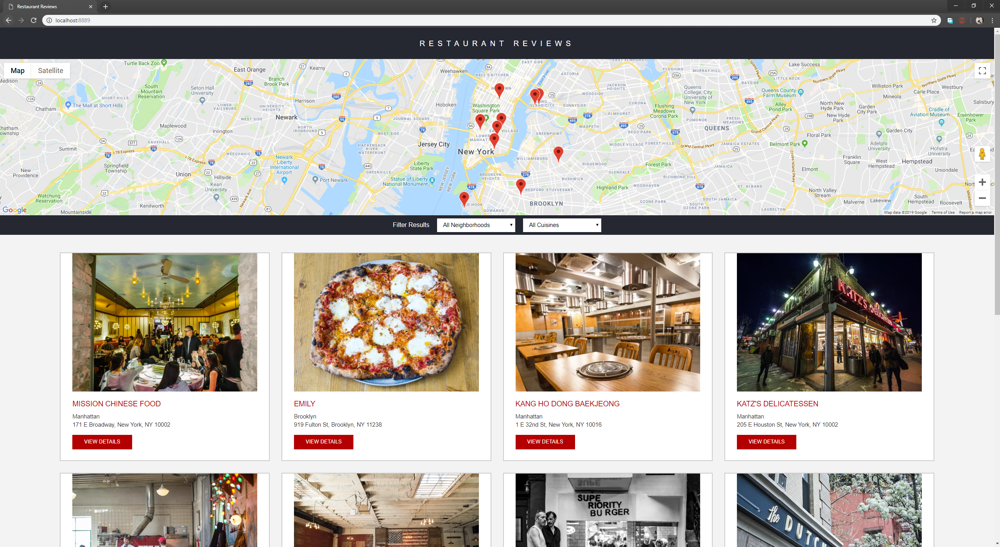

# Restaurant Review App
---
#### This app  is created as part of the Udacity Nanodegree "Front-End Developer". 

## Project Overview: Stage 1 

- accessibility
- responsiveness
- offline first

## Features

- View all restaurants
- View restaurants for a specific district or cuisine
- View details to a restaurant like opening hours and reviews
- View already loaded pages also in offline mode
- Accessibility: Use the app with screen reader or keyboard-only

### Specification

You have been provided the code for a restaurant reviews website. The code has a lot of issues. It’s barely usable on a desktop browser, much less a mobile device. It also doesn’t include any standard accessibility features, and it doesn’t work offline at all. Your job is to update the code to resolve these issues while still maintaining the included functionality.

### Project Rubric

Your project will be evaluated by a Udacity code reviewer according to the [Restaurant Reviews project rubric](https://review.udacity.com/#!/rubrics/1090/view). Please review for detailed project requirements. The rubric should be a resource you refer to periodically to make sure your project meets specifications.

